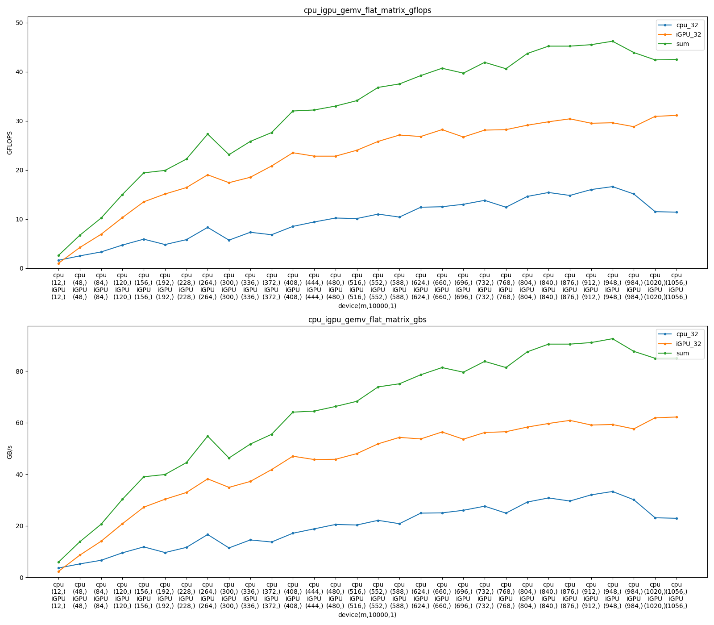

# 设备GEMM GEMV性能测试

* 说明
  1. llama.cpp 启用clblast编译后，在[文件位置](https://github.com/JIANGJZ/ComboLLM/blob/c65256f41354e1d0191d49a4f18fdf34b772f31c/ggml.c#L7594)处对GPU启用opencl。而CPU始终使用自行实现的多线程并行矩阵运算
  2. 考虑到上述情况，将对CPU和iGPU测试clblast的gemm和gemv峰值性能。同时对cpu使用多线程AVX2测试: 实际自行实现的代码效率过低，改为使用clblast结果作为参考。
* clblast版本：1.6.1
  * 通过apt install 安装的可能是1.5.2，为21年的代码比较旧。这里采用手动安装clblast1.6.1

---

1. CPU/iGPU blast gemm、gemv性能测试

* clblast已经实现了[benchmark框架](https://github.com/CNugteren/CLBlast/blob/master/doc/benchmarking.md)

  1. 首先确认当前平台GPU是否已经在[clblast中优化](https://github.com/CNugteren/CLBlast/blob/master/doc/tuning.md)过，大多数主流平台已经被优化
     * 例如，我的iGPU是gfx1035 680M，可以查到已经被优化
  2. 测试配置：每两项为一行，每一行第一列为GFLOPS结果，第二行为访存带宽
     1. gemm 方阵测试
     2. gemm flat矩阵 @ tall矩阵
     3. gemv 方阵 @ 向量

  ```
      GEMM_GEMV_BENCH = {
          "num_rows": 3, "num_cols": 2,
          "benchmarks": [
              {
                  "name": "gemm normal", "num_runs": 20,
                  "title": "GEMM",
                  "x_label": "matrix sizes (m=n=k)", "x_keys": ["m"],
                  "y_label": "GFLOPS (higher is better)", "y_key": "GFLOPS",
                  "arguments": [{"m": 128, "n": 128, "k": 128, "layout": 102,
                              "transA": 111, "transB": 111, "step": 128, "num_steps": 20}],
              },
              {
                  "name": "gemm normal - memory", "num_runs": 20,
                  "title": "GEMM Memory",
                  "x_label": "matrix sizes (m=n=k)", "x_keys": ["m"],
                  "y_label": "GB/s (higher is better)", "y_key": "GBs",
                  "arguments": [{"m": 128, "n": 128, "k": 128, "layout": 102,
                              "transA": 111, "transB": 111, "step": 128, "num_steps": 20}],
              },
              {
                  "name": "gemm flat", "num_runs": 20,
                  "title": "GEMM flat matrix @ thin matrix",
                  "x_label": "matrix sizes (m,n,k)", "x_keys": ["m","n"],
                  "y_label": "GFLOPS (higher is better)", "y_key": "GFLOPS",
                  "arguments": [{"m": 12, "n": 10000, "k": 12, "layout": 102,
                              "transA": 111, "transB": 111, "step": 24, "num_steps": 40}],
              },
              {
                  "name": "gemm flat", "num_runs": 20,
                  "title": "GEMM flat matrix @ thin matrix",
                  "x_label": "matrix sizes (m,n,k)", "x_keys": ["m","n"],
                  "y_label": "GB/s (higher is better)", "y_key": "GBs",
                  "arguments": [{"m": 12, "n": 10000, "k": 12, "layout": 102,
                              "transA": 111, "transB": 111, "step": 24, "num_steps": 40}],
              },
              {
                  "name": "gemv normal", "num_runs": 40,
                  "title": "multiples of 256",
                  "x_label": "sizes (n=m)", "x_keys": ["n"],
                  "y_label": "GFLOPS (higher is better)", "y_key": "GFLOPS",
                  "arguments": [{"n": 256, "m": 256, "incx": 1, "incy": 1, "layout": 102, "step": 256, "num_steps": 40}],
              },
              {
                  "name": "gemv normal - memory", "num_runs": 40,
                  "title": "multiples of 256",
                  "x_label": "sizes (n=m)", "x_keys": ["n"],
                  "y_label": "GB/s (higher is better)", "y_key": "GBs",
                  "arguments": [{"n": 256, "m": 256, "incx": 1, "incy": 1, "layout": 102, "step": 256, "num_steps": 40}],
              },
          ]
      }
  ```

  2. CPU

     
  3. iGPU

     

2. cpu和igpu同时计算
   1. 实现
      1. 参照clblast[benchmark框架](https://github.com/CNugteren/CLBlast/blob/master/doc/benchmarking.md)，实现了mbenchmark.py，把它放置到clblast中benchmark.py的文件即可运行
      2. msetting.py包含了测试配置，也需要放置到clblast中与setting.py相同的文件夹
   2. 初步结论
      * gemm与预期相同，两个同时计算没有干扰
      * gemv与预期不同，cpu与igpu同时计算没有明显干扰，与前面的单独计算的数据对比可以发现单一设备性能没有明显下降
        * 推测原因：由单独的设备gemv数据可以发现，cpu在gemv时访存仅30GB/s远没有达到内存速度上限。gemv的计算密度比较低，在设备的roofline访存受限区域，所以其最大的带宽占用也受限于设备并行单元的规格。其中igpu在gemv时最大访存为速度为60GB/s。设备的极限带宽约为80-85GB/s，所以同时运算时访存瓶颈只有5-10GB/s。
        * 进一步加大gemv中矩阵的尺寸，如实验结果4，可以观察到cpu与igpu同时计算存在非常小的干扰，与带宽瓶颈占比5/80=6.25%吻合
   3. 实验结果
      1. 同时进行方阵gemm运算
         
      2. 同时进行扁平矩阵@扁平矩阵^T gemm运算
         
      3. 同时进行 方阵@向量 gemv运算
         
      4. 同时进行 大方阵@向量 gemv运算
         
      5. 同时进行 扁平矩阵@向量 gemv运算
         
